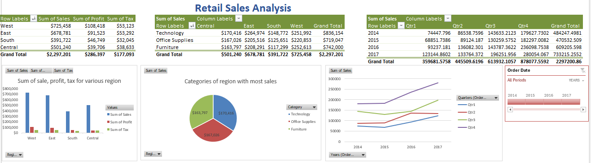
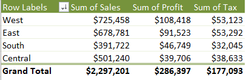
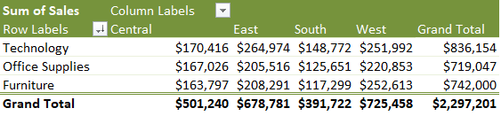
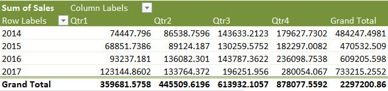

# Tittle: Retail Sales Analysis

# Table of contents

- [Problem Statement](#problem-statement)
- [User story](#user-story)
- [Data source](#data-source)
- [Stages](#stages)
- [Data cleaning](#data-cleaning)
- [Visualization](#visualization)
- [Analysis](#analysis)
 - [Findings](#findings)
 - [Discovery](#discovery)
- [Recommendations](#recommendations)
- [Conclusion](#conclusion)

# Problem Statement

- What is the key main point?

A US retail company wants to analyze sales data to generate insights for their growth. The  company wants to know the most profitable region and the product categories that  generate the most profit. The aim of this project is to build an interactive microsoft excel dashboard to allow the users to quickly identify trends in the retail sales.

- What is the ideal solution?

To create a dashboard that provides insights into: 

- What region generates the most sales, profit, and tax?
- What categories generate the most sales per region?
- What is the sales performance per quarter for the 3 years? 

This will help the company to make informed decisions on how to maximum its sales.

# User story

As a data analyst in the company, i have been tasked with working on this project. I have identified the data i need, asked the right questions, and collected the dataset.

With this information, I can make more informed decisions that can generate insights.

# Data source

- What data is needed to achieve this objective?

We need data on the product orders, customers and ship mode which includes their

- order country
- time period
- region
- customers, order and product ID
- sales, profit & tax etc.

# Stages

- Examine both product, order and customer datasets for inconsistencies, missing values, outliers, correctly identify categorical and numerical data.
- Define metrics such as total sales, time trend, profit, sales and tax etc.
- Explore the data, create charts and graphs to visualise trends and insights for recommendations.

# Data cleaning

- What do we expect the clean data to look like?
- What should it contain?
- What limitations should we apply to it?

The aim is to refine our dataset to ensure it is structured and ready for analysis.

The cleaned data should meet the following criteria and constraints:
- Only relevant columns should be retained.
- All data types should be appropriate for the contents of each column.
- No column should contain null values, indicating complete data for all records.

# Visualization

## Results
- What does the dashboard look like?
  

This shows the retail sales dashboard.

# Analysis

## Findings
- What did we find?
For this analysis, we’re going to focus on the questions below to get the information we need for our client.

Here are the key questions we need to answer for our client:

1. What region generates the most sales, profit, and tax?
2. What categories generate the most sales per region?
3. What is the sales performance per quarter for the 3 years? 

### 1. What region generates the most sales, profit, and tax?

### 2. What categories generate the most sales per region?

### 3. What is the sales performance per quarter for the 3 years?

# Discovery

- What did we learn?

We discovered that
1. The west region generate the most sum of sales and profit while the east region generate the most sum of tax.
2. With the categories, the technology categories generate the most sum of sales compared to the rest.
3. The sale performance per quater, have been fluctuating over the years with the highest quater achieving a value of 280054.067 in the year 2017.

 # Recommendations

- What do you recommend based on the insights gathered?

1. Sales have been rapidly increasing at the end of every fourth quater so therefore, i recommend an increase in production within this period in the coming year.
2. Since the technology category generate most sales, i recommend that a small portion of the production cost for furniture be subtracted and added to the technology sector, in other to maximize additional profit.
3. Finally, the west region should be our top region for selling most product especially, in the aspect of technology.

# Conclusion

Base on the findings and analysis of the US retail sales dashboard, we can conclude that the project showcases the effectiveness of exploratory data analysis in providing useful insights in dataset that was used to make better prediction for the company.
